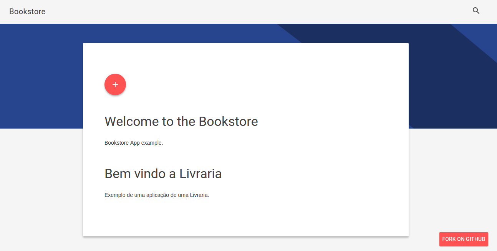

# Bookstore

Modelagem de banco de dados de uma livraria.

> Python 3.4.3 e Django 1.9.1


```bash
$ virtualenv -p python3 bookstore
$ cd bookstore
$ source bin/activate
$ PS1="(`basename \"$VIRTUAL_ENV\"`)\e[1;34m:/\W\033[00m$ "; clear
$ vim ~/.bashrc +
alias manage='python $VIRTUAL_ENV/manage.py'
$ pip install -r requirements.txt
$ django-admin.py startproject bookstore_project . # tem um ponto '.' aqui
$ manage startapp core
```

## Migração

Depois que criar os modelos faça:

```bash
$ manage makemigrations core
$ manage migrate
$ manage createsuperuser --username='admin' --email='' # agora a senha deve ter 8 dígitos
$ manage loaddata fixtures.json
$ manage runserver
```


## Screenshot




## Login

### shell

```python
from django.contrib.auth.models import User, Group
user = User.objects.create_user(username='regis',password='admin')
user.is_staff = True
user.save()
user.user_permissions.all()
group = Group.objects.create(name='Diretor')
user = User.objects.get(username='regis')
user.groups.add(group)
user = User.objects.create_user(username='arthur',password='1234')
user.is_staff = False
user.save()
user.user_permissions.all()
group = Group.objects.create(name='Técnico')
user = User.objects.get(username='arthur')
user.groups.add(group)
user.groups.all()
```

http://stackoverflow.com/questions/4789021/in-django-how-do-i-check-if-a-user-is-in-a-certain-group

### views.py

```python
from django.conf import settings
from django.views.generic import TemplateView
from braces.views import GroupRequiredMixin

class SomeProtectedView(GroupRequiredMixin, TemplateView):
	# required
	# group_required = [u'Diretor', u'admin']
	group_required = u'Diretor'
```

http://django-braces.readthedocs.org/en/latest/access.html#grouprequiredmixin

http://extracts.panmacmillan.com/getextracts